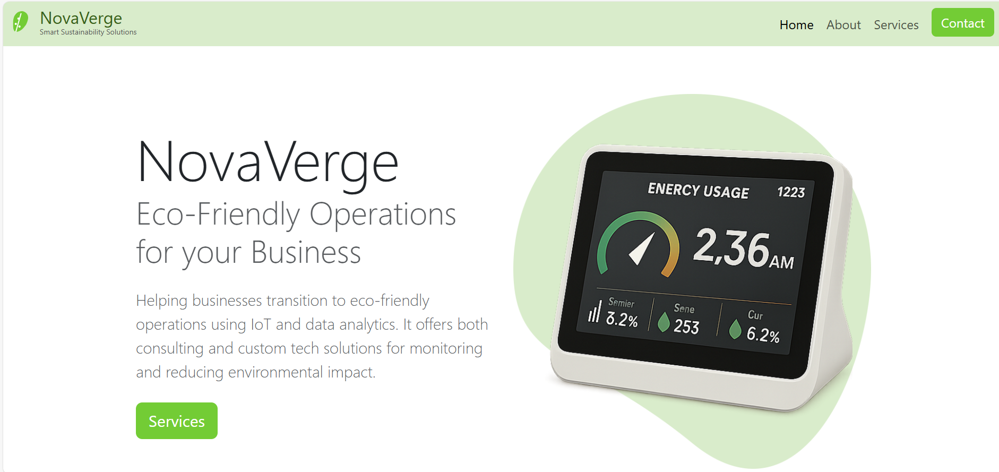
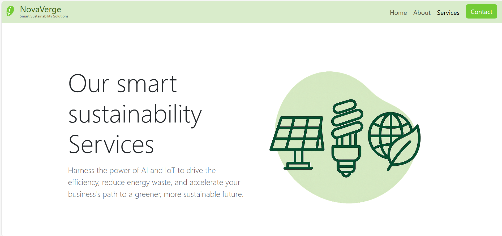
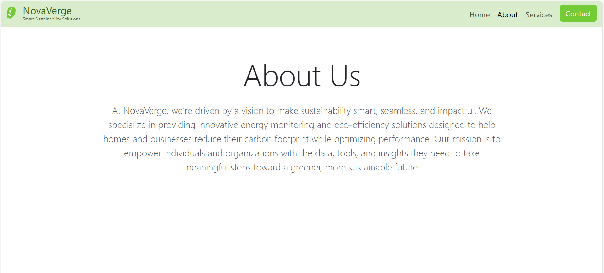

# 🌿 NovaVerge — Sustainable Tech Consulting (Demo Website)

**NovaVerge** is a **concept website** created as a professional front-end development project using **HTML**, **CSS**, **Bootstrap**, and **JavaScript**. It represents a clean, modern consulting firm focused on eco-friendly operations and smart technologies.

> 🧪 This is a demonstration project built to showcase web development skills. The business and services are part of a fictional scenario developed for portfolio purposes.

---

## 💡 Project Purpose

NovaVerge simulates a modern, professional tech consulting website. It includes multiple sections and pages that demonstrate key web development techniques:

- **Responsive design** using Bootstrap
- **Clean layout & animations** (AOS integration)
- **Multi-page navigation**: Home, About, Services, Contact
- **Google Forms integration** for demo contact form
- **Professional branding** including favicon, logo, and color theme

---

## 🖼️ Preview Screenshots

### 📸 Screenshots

| Page | Preview |
|------|---------|
| 🏠 **Landing Page** |  |
| 🛠️ **Services Page** |  |
| 📖 **About Us Page** |  |

---

## 📁 Tech Stack

- ✅ HTML5
- 🎨 CSS3
- ⚙️ Bootstrap 5
- 🧠 JavaScript (Vanilla)
- 🎞️ AOS (Animate on Scroll)
- 📩 Google Forms (contact form handling)

---

## 📬 Contact

Feel free to reach out if you'd like to discuss this project or see more of my work:

🔗 [GitHub Profile](https://github.com/usman-iqbal-5)  

---

## 📌 Project Status

🚧 Uncompleted — Still being developed
🔧 Not connected to any backend or real services  
🧪 Built as part of a portfolio to demonstrate HTML/CSS/JS and responsive design

---

